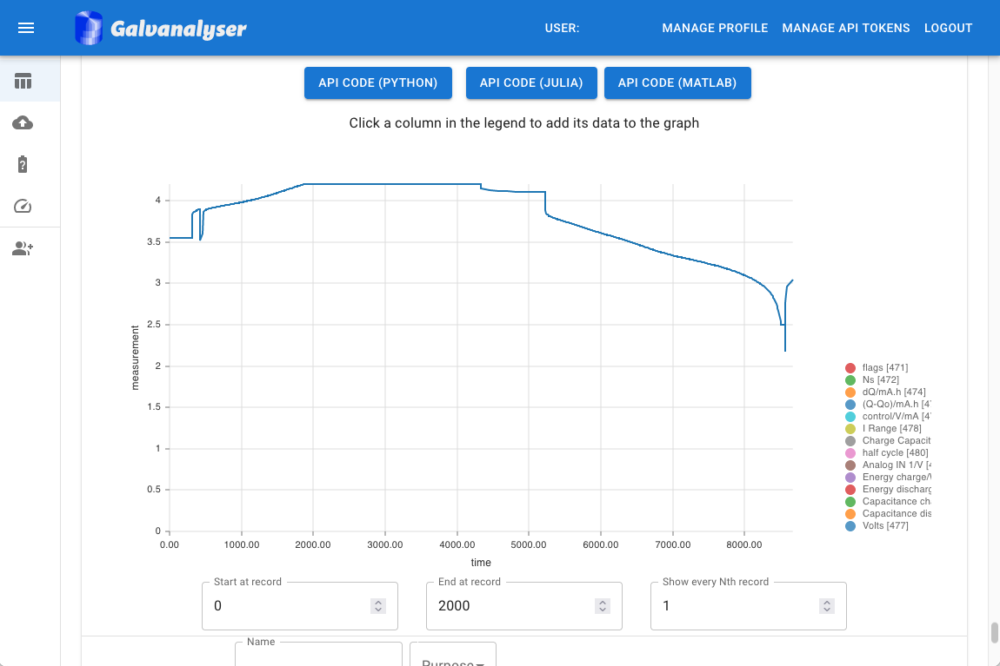

# Galv

Galv is an open-source platform for automated storage of battery data with advanced metadata support for battery scientists. 
Galv is deployed with [Docker](https://docs.docker.com/) to support robust local and cloud instances. 
An example frontend view is displayed below. 

## Features:
- REST API for easy data storage and retrieval
- A Python, Julia, and MATLAB client for the REST API
- Metadata support using ontology definitions from BattINFO/EMMO
- A distributed platform with local data harvesters
- Docker based deployment

## Specification

Galv is built on a REST API specification.

The schema can be downloaded from the [documentation page](https://Battery-Intelligence-Lab.github.io/galv-spec/UserGuide.html#api-spec). 
If you run your own instance of Galv, it will make its own schema available at `/schema/`, 
and provide Swagger-UI and ReDoc documentation at `/schema/swagger-ui/` and `/schema/redoc/` respectively.

The below diagram presents an overview of Galv's architecture. 
The arrows indicate the direction of data flow.

    

